# Jeva

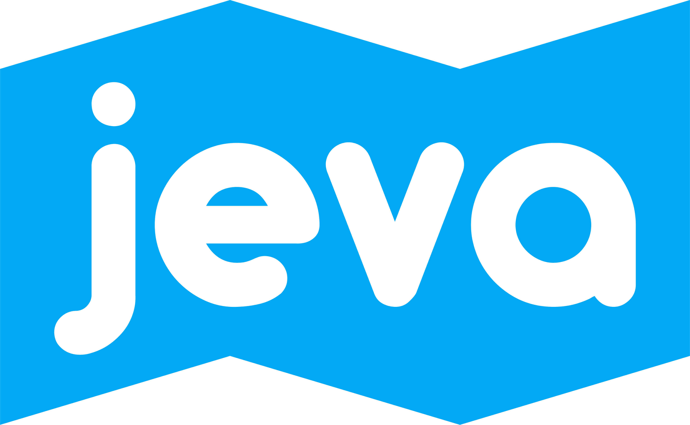

**Planificador de rutas** desarrollado por José Morera Figueroa, Enrique Fernández Corrales, Víctor Rosario Núñez y Alan Trawczynski, para la asignatura CM 20/21.  
Logo y supervisión del diseño gráfico por [Alba Lobato](https://albalobatodesign.pb.design).

Para más información consultar la [presentación](readme-files/presentation.pdf).

  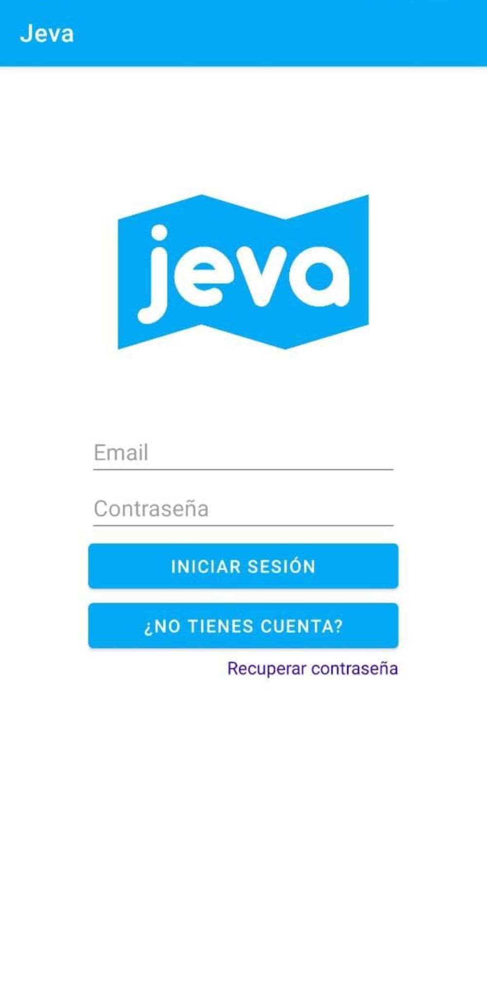
  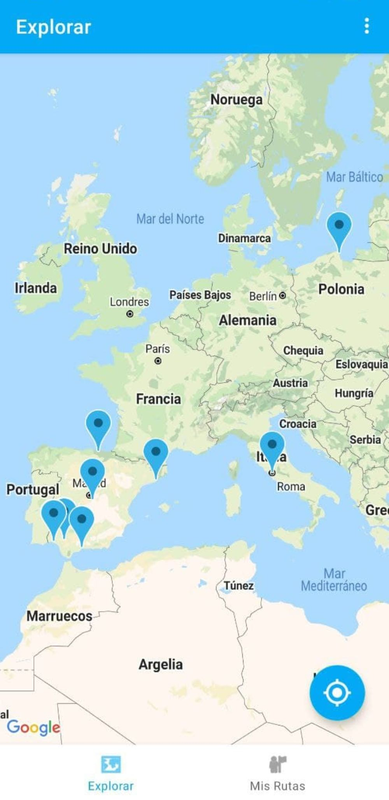
  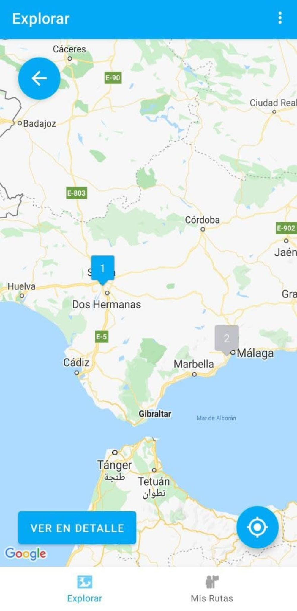
  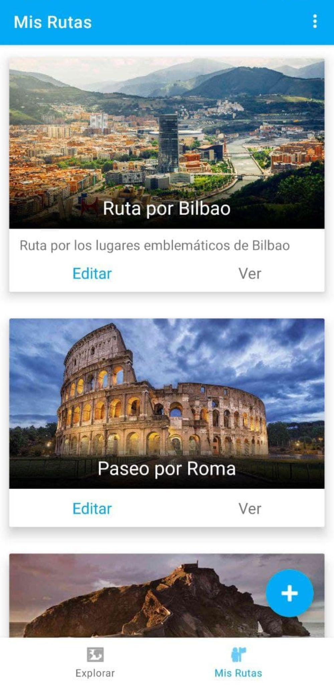
  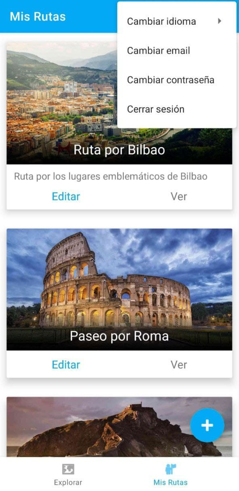
  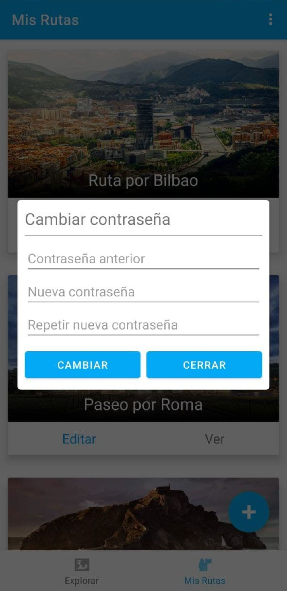
  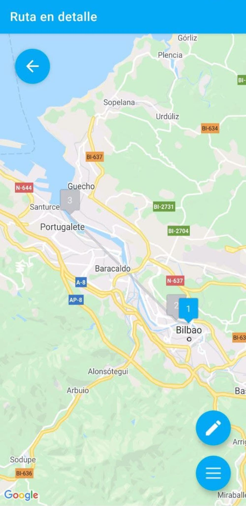
  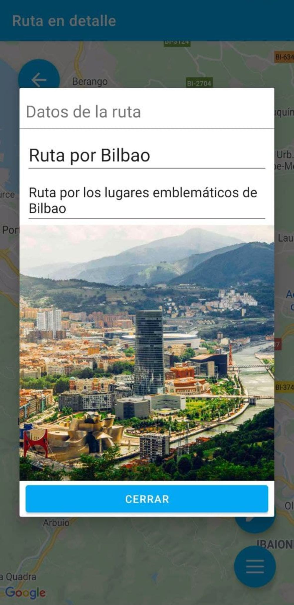
  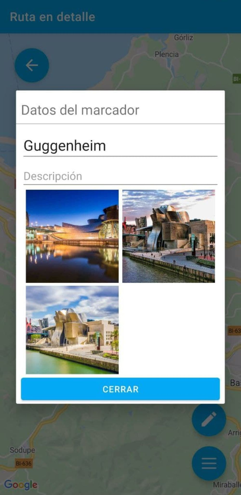
  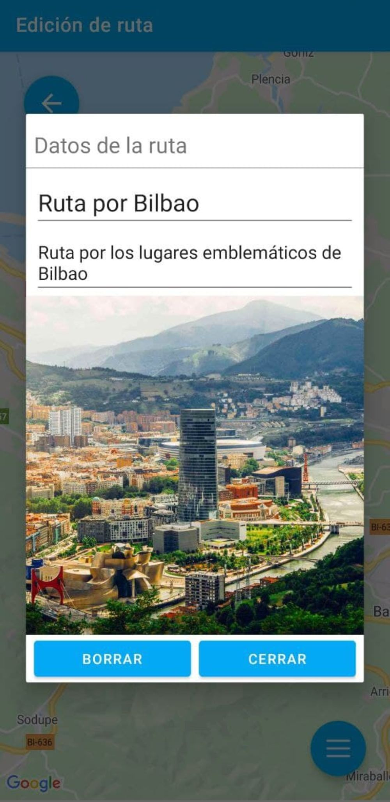
  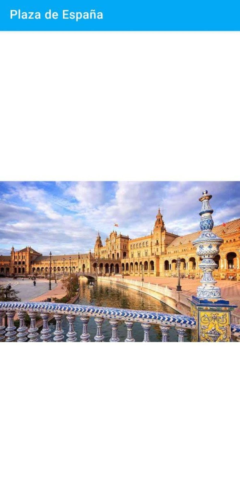

